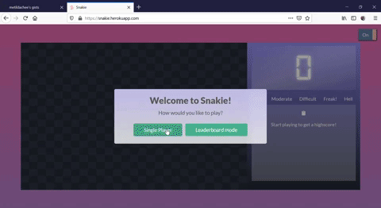
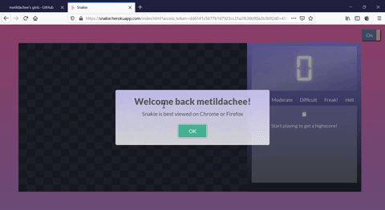
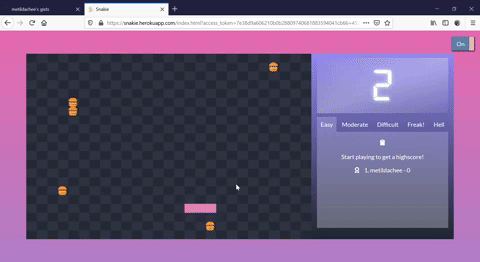
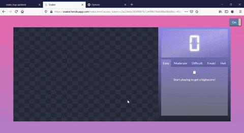
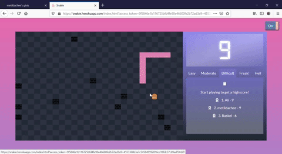

# Snakie!
Snakie is a browser based, classic snake game.

## Gameplay
The objective of the game is to eat as many burgers as possible. There are a total of 5 levels, and players can select the difficulty level as they wish. 

- [Snakie!](#snakie-)
  * [Gameplay](#gameplay)
  * [Snakie version 1](#snakie-version-1)
    + [Installation](#installation)
    + [Basic gameflow](#basic-gameflow)
    + [Limitations](#limitations)
  * [Snakie version 2](#snakie-version-2)
    + [Installation](#installation-1)
    + [Basic gameflow](#basic-gameflow-1)
      - [Single player mode](#single-player-mode)
        * [Login using Github](#login-using-github)
        * [Standard username](#standard-username)
      - [Leaderboard mode](#leaderboard-mode)
        * [Login using Github](#login-using-github-1)
    + [Limitations](#limitations-1)
  * [Many thanks!](#many-thanks-)

## Snakie version 1
* Night/day mode

Players can switch to their preferred mode by toggling the top right button

### Installation
Players can visit [Snakie](https://metildachee.github.io/snakie/) to play the classic game. Usernames are recorded as cookies.

### Basic gameflow
When the game first starts, players are prompted for a username

    
The site will welcome the player on subsequent visits

The game starts off easy, with the snake moving slowly and having more hamburgers.

As the levels get more difficult, the speed of the snake increases and barriers are included..

... and more barriers... you get it..

### Limitations
* Note, this is the only option if you choose to play the game online.
* Also note, this game is not supported on mobile.
* Scores are not recorded.

## Snakie version 2
Snakie now features a single player mode and a leaderboard mode with score recording ability.

### Installation
Players can visit [Snakie version 2](https://snakie.herokuapp.com/) to play.

### Basic gameflow

#### Single player mode
Players can choose to either:

1. Login with Github. This allows the user to record their scores on [Gist](https://gist.github.com/metildachee/d446fc2c12bad5a95985699ae8fcb40c)

2. Or play with a standard username.

##### Login using Github

Players are prompted for their Github username and password.

After which, a snake_logs Gist will be created; should the player not have played before, the file will be created. 

Should the file already exist, previous scores will be updated in the highscore board.

Logs are updated as the player plays.

... you get the gist.

##### Standard username

This is [Snakie version 1](#snakie-version-1)

#### Leaderboard mode

This mode allows anyone to make a highscore on the leaderboard.

##### Login using Github 
To play leaderboard mode, players must login to Github.

If the player has not played before, they will be given instructions on how to play.

If the player has played before, they will be shown a welcome page and their previous scores will be updated.

Only the top 3 and current player's scores are updated, this allows the player to see how far they have to the top score.

If the player is already in the top rank... congrats!

### Limitations 
1. Grossly insecure; iykyk
2. Blatantly inadequate approach
3. Slow performance and many deprecations
4. Single player must have at least 1 Gist on their account, otherwise application will have unpredictable behaviour
5. No mobile too 😅

## Many thanks!
* [SweetAlert2](https://sweetalert2.github.io/)
* [Animate.css](https://animate.style/)
* [Gist API](https://developer.github.com/v3/gists/)
* [GitHub OAuth Webflow](https://developer.github.com/apps/building-oauth-apps/authorizing-oauth-apps/)
* [Cookies](https://www.w3schools.com/js/js_cookies.asp)
* [AJAX and Gist](http://techslides.com/github-gist-api-with-curl-and-ajax)
* [Node.js OAuth example](https://github.com/sohamkamani/node-oauth-example)
* [TOC Generator](https://ecotrust-canada.github.io/markdown-toc/)