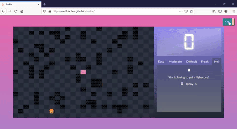
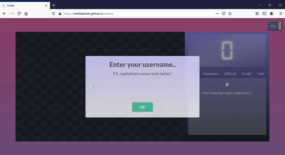
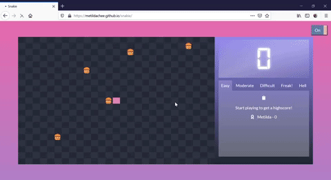
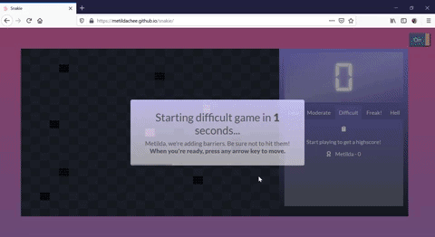
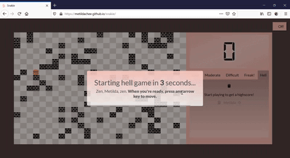

# Snakie!
Snakie is a browser based, classic snake game.

## Gameplay
The objective of the game is to eat as many burgers as possible. There are a total of 5 levels, and players can select the difficulty level as they wish. 

- [Snakie version 1](#snakie-version-1)
  * [Installation](#installation)
  * [Basic gameflow](#basic-gameflow)
  * [Limitations](#limitations)

## Snakie version 1
* Night/day mode

Players can switch to their preferred mode by toggling the top right button

### Installation
Players can visit [Snakie](https://metildachee.github.io/snakie/) to play the classic game. Usernames are recorded as cookies.

### Basic gameflow
When the game first starts, players are prompted for a username

    
The site will welcome the player on subsequent visits

The game starts off easy, with the snake moving slowly and having more hamburgers.

As the levels get more difficult, the speed of the snake increases and barriers are included..

... and more barriers... you get it..

### Limitations
* Note, this is the only option if you choose to play the game online.
* Also note, this game is not supported on mobile.
* Scores are not recorded.

## Many thanks!
* [SweetAlert2](https://sweetalert2.github.io/)
* [Animate.css](https://animate.style/)
* [Cookies](https://www.w3schools.com/js/js_cookies.asp)