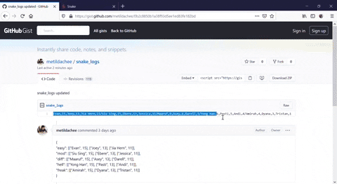
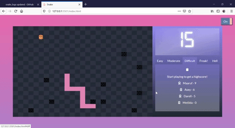

# Snakie!
Snakie is a browser based, classic snake game.

## Gameplay
The objective of the game is to eat as many burgers as possible. There are a total of 5 levels, and players can select the difficulty level as they wish. 

- [Snakie version 1](#snakie-version-1)
  * [Installation](#installation)
  * [Basic gameflow](#basic-gameflow)
  * [Limitations](#limitations)
- [Snakie version 2](#snakie-version-2)
  * [Installation](#installation-1)
  * [Basic gameflow](#basic-gameflow-1)
  * [Limitations](#limitations-1)

## Snakie version 1
* Night/day mode
    * Players can switch to their preferred mode by toggling the top right button
    

    

### Installation
Players can visit [Snakie](https://metildachee.github.io/snakie/) to play the classic game. Usernames are recorded as cookies.

### Basic gameflow
When the game first starts, players are prompted for a username


    
The site will welcome the player on subsequent visits


The game starts off easy, with the snake moving slowly and having more hamburgers.


As the levels get more difficult, the speed of the snake increases and barriers are included..


... and more barriers... you get it..


### Limitations
* Note, this is the only option if you choose to play the game online.
* Also note, this game is not supported on mobile.
* Scores are not recorded.

## Snakie version 2
* Record your score on [Gist](https://gist.github.com/metildachee/0b2c8850b1a38f93d5ee1ed83fe182bd) using [PAT](https://help.github.com/en/github/authenticating-to-github/creating-a-personal-access-token)

### Installation
1. Clone/download this repository
2. Create your [Personal Access Token](https://help.github.com/en/github/authenticating-to-github/creating-a-personal-access-token), set permission access to gist
3. Run `git checkout version-2` on your terminal
4. In file `token_sample.js`, replace the values
    ```
    let SECRET_TOKEN = "your-secret-token-value";
    let USERNAME = "your-github-username";
    ```
5. Rename the file from `token_sample.js` to `token.js` 
6. Back on the browser, [create](https://gist.github.com/) a public Gist with a name of `snake_logs`
7. Paste the following starter logs in `snake_logs`,
    ```
    John,15,Mary,13,Jia Hui,11/Melanie,15,Lauren,13,Hauber,11/Ali,9,Raskel,6,Vanille,5/Noel,6,Doe,5,Xiao,4/Mickey,4,Kasey,3,Kai,1
    ```
8. You can run the game and start playing, your Gist should automatically update.

### Basic gameflow


Logs are read off from default values.



Game stats are recorded and sorted in descending order.

### Limitations
* Users are expected to only have 1 Gist (...what?)
* The default values must be copy and pasted; not doing so will cause unexpected behaviour
* Long installation process

## Many thanks!
* [SweetAlert2](https://sweetalert2.github.io/)
* [Animate.css](https://animate.style/)
* [Gist API](https://developer.github.com/v3/gists/)
* [Cookies](https://www.w3schools.com/js/js_cookies.asp)