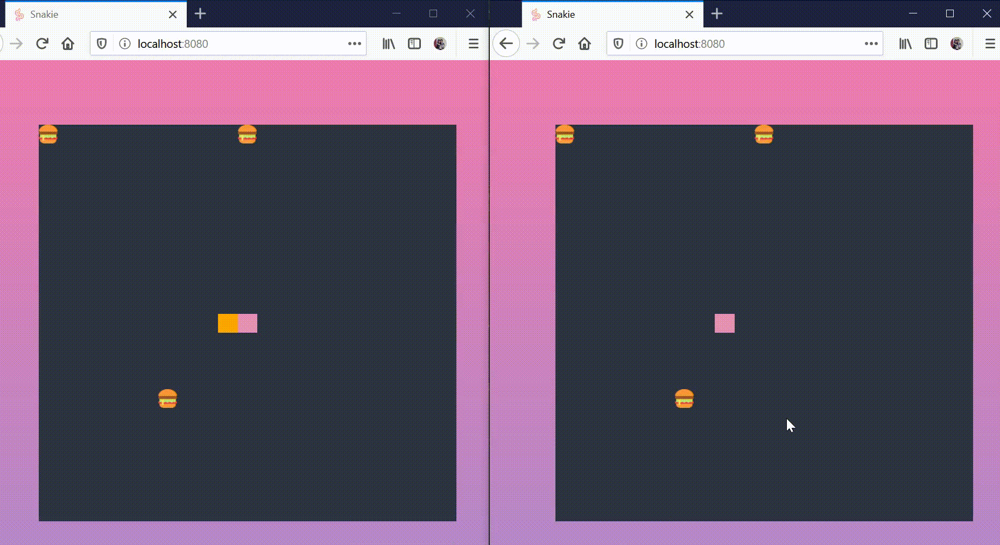

# Snakie!
Snakie is a web browser based, classic snake game.

## Gameplay
The objective of the game is to eat as many burgers as possible. There are a total of 5 levels, and players can select the difficulty level as they wish. 

- [Snakie!](#snakie)
  * [Gameplay](#gameplay)
  * [Snakie version 1 - Basic](#snakie-version-1---basic)
    + [How to play?](#how-to-play)
    + [How does the game work?](#how-does-the-game-work)
    + [What was the approach?](#what-was-the-approach)
    + [Limitations](#limitations)
  * [Snakie version 2 - Record scores](#snakie-version-2---record-scores)
    + [How to play?](#how-to-play-1)
    + [How does the game work?](#how-does-the-game-work-1)
      - [Single player mode](#single-player-mode)
        * [Login using Github](#login-using-github)
        * [Standard username](#standard-username)
      - [Leaderboard mode](#leaderboard-mode)
        * [Login using Github](#login-using-github-1)
    + [What was the motivation?](#what-was-the-motivation)
    + [Limitations](#limitations-1)
  * [Snakie version 3 - Real time multi-player (coming soon)](#snakie-version-3---real-time-multi-player-coming-soon)
  * [What can be done better?](#what-can-be-done-better)
  * [Many thanks!](#many-thanks)

## Snakie version 1 - Basic
* Night/day mode

Players can switch to their preferred mode by toggling the top right button

### How to play?
Players can visit [Snakie](https://metildachee.github.io/snakie/) to play the classic game. Usernames are recorded as cookies.

### How does the game work?
When the game first starts, players are prompted for a username

    
The site will welcome the player on subsequent visits

The game starts off easy, with the snake moving slowly and having more hamburgers.

As the levels get more difficult, the speed of the snake increases, the snake grows and barriers are included..

... and more barriers... you get it..

### What was the approach?
* User interface

My intent was to create a flexible snake game where the screen size determined the grid size. Hence, a grid with variables `rows` and `cols` was used. These variables adjusted the actual grid. These variables are then ported over to Javascript for game logic. 

For the aesthetics, I wanted to try something different. Usually I tended to something cuter, but this time around I wanted to try something a bit more cyber-punkish. It's not my forte but... Never try never know! 🤣

* Premise

The entire premise of the game is stacked on the fact that the window is being rendered every xxx milliseconds. Knowing this, I really wanted to try different speed levels, which added more contrast to the different levels. This was later used to determine the building characteristics of different levels.

* Game setup - the motivation to use OOP
  * Block - Food, Barrier, Snake

I knew that I wanted to implement different amounts of food and barrier in different levels. These variables had to be flexible, and that I didn't want the hassle of declaring objects. What if I wanted 20 blocks in this level but only 1 in the next level? I needed something that abstracted these details.

With this, using OOP made sense as I could use a class `Block` with `(x, y)` coordinate to extend to `Food` and `Barrier`. In fact, `Snake` is nothing but a container of different `Block`.

  * Snake

The essence of the snake is that when it moves, the last element appears on the head of the snake. This reminded me of a `Deque`. So I applied the same principles.

  * Level

Initially, I didn't use a class for the different levels and instead, wrote many switch cases. Slowly, this became annoying as I had to keep track of all the global variables like `SPEED`, `EXPAND_FACTOR`, `NUM_OF_FOOD`... You get it. It made more sense to use a single `Levels` array to store these `Level` which held different properties. This was a class that I didn't think I needed.. But served meaningfully once created.

  * Game?

I also considered making a `Game` class to keep track of information like the current level the user is in, if they are viewing from night mode, the player's username... etc, loose variables. I opted out of it as I considered myself slowly becoming OOP-obsessed 😅

### Limitations
* Note, this game is not supported on mobile.
* Scores are not recorded.

## Snakie version 2 - Record scores
Snakie now features a single player mode and a leaderboard mode with score recording ability.

### How to play?
Players can visit [Snakie version 2](https://snakie.herokuapp.com/) to play.

### How does the game work?

#### Single player mode
Players can choose to either:

1. Login with Github. This allows the user to record their scores on [Gist](https://gist.github.com/), please see [sample](https://gist.github.com/metildachee/d13d4c3c249223f30282c6d2942d3b74) here

2. Or play with a standard username.

##### Login using Github

Players are prompted for their Github username and password.

After which, a `snake_logs` Gist will be created; should the player not have played before, the file will be created. 

Should the file already exist, previous scores will be updated in the highscore board.

Logs are updated as the player plays.

... you get the gist.

##### Standard username

See [Snakie version 1](#snakie-version-1)

#### Leaderboard mode

This mode allows anyone to make a highscore on the [leaderboard](https://gist.github.com/metildachee/4236c7cab8ae755ce2800703d6588d68).

##### Login using Github 
To play leaderboard mode, players must login to Github.

A new player will be given instructions on how to play.

A seasoned player will be shown a welcome page and their scores will be updated.

Only the top 3 and current player's scores are updated, this allows the player to see how far they have to the top score.

If the player is already in the top rank... congrats!

### What was the motivation?

I created this version purely on the obsession of recording scores. I thought that if I had a file online that everyone could read and write to, perhaps I could create a makeshift leaderboard (?) without a hassle of a database 😅😅😅😅😅😅.

That was the entire motivation behind this rabbit hole into the Github API. After reading and trying it out, I realise that my original purpose couldn't be accomplished without compromising security. Hence, the inclusion of oAuth and writing to user's personal Gist. It was a tragic discover but I'm glad that I tried it out 😆

### Limitations 
1. Insecure; iykyk
2. Inadequate approach
3. Slow performance
4. Single player must have at least 1 Gist on their account
5. Not suitable for playing on mobile devices

## Snakie version 3 - Real time multi-player (coming soon)
This version would allow multiple players to play at the same time.

## What can be done better?
* UI/UX
* Efficienct and optimised code
* OOP or not?
* .... ++ 

## Many thanks!
* [SweetAlert2](https://sweetalert2.github.io/)
* [Animate.css](https://animate.style/)
* [Gist API](https://developer.github.com/v3/gists/)
* [GitHub OAuth Webflow](https://developer.github.com/apps/building-oauth-apps/authorizing-oauth-apps/)
* [Cookies](https://www.w3schools.com/js/js_cookies.asp)
* [AJAX and Gist](http://techslides.com/github-gist-api-with-curl-and-ajax)
* [Node.js OAuth example](https://github.com/sohamkamani/node-oauth-example)
* [TOC Generator](https://ecotrust-canada.github.io/markdown-toc/)